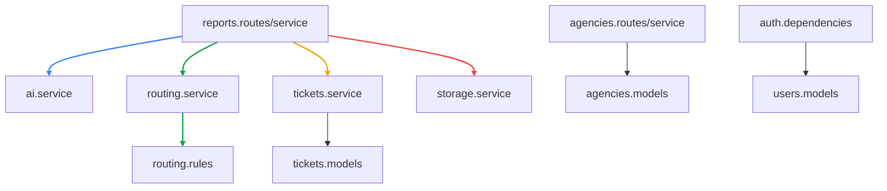
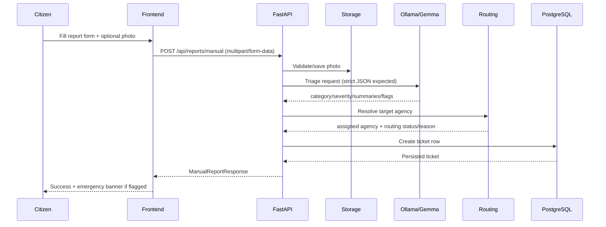
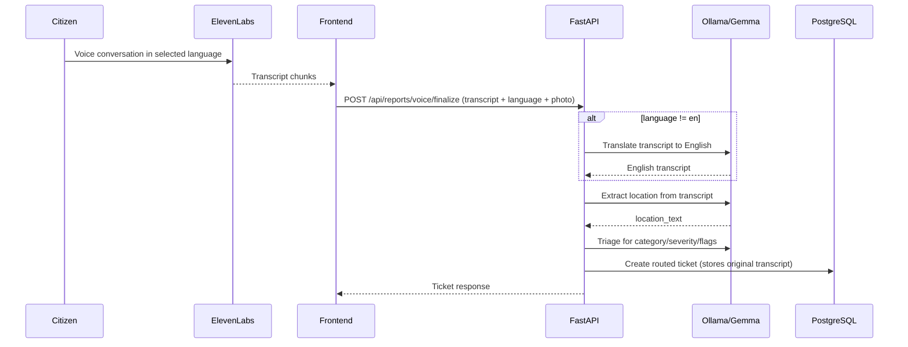
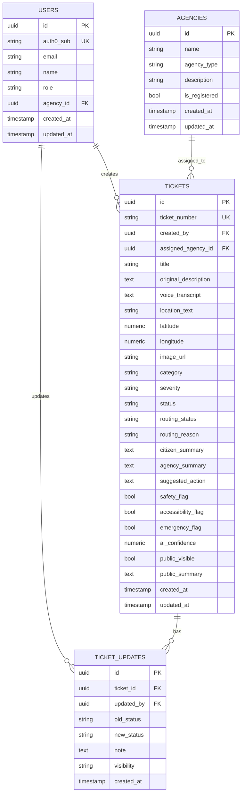

# CivicFix Technical Documentation

## 1) Project Scope: Initial Plan vs Current Build

The original scope (from the technical planning document) defined CivicFix as a role-based civic issue platform with:
- Manual + voice intake
- AI triage and deterministic routing
- Citizen, agency, and admin dashboards
- Auth0-secured access and RBAC

### What is implemented right now
- Manual report intake (`/api/reports/manual`)
- Voice report intake with ElevenLabs + multilingual support (`/api/reports/voice/finalize`)
- Local LLM triage using Ollama-hosted Gemma (`app/ai/*`)
- Deterministic category-to-agency routing (`app/routing/*`)
- Agency Kanban operations (status moves, reassignment)
- Public sanitized ticket board and citizen “My Issues” board
- Agency AI assistants (chat + voice) for ticket operations
- Docker monolith deployment (nginx + FastAPI + Next.js) and split local dev mode

### Not fully implemented yet (or placeholder)
- Full Auth0 JWT validation and strict backend RBAC (current auth is dev header stub)
- Admin metrics dashboard (frontend page is currently placeholder)
- Ticket detail page with role-specific rendering (currently placeholder)
- Dedicated dashboard aggregation service module
- Alembic migration set for production schema evolution (models are auto-created on startup)

---

## 2) High-Level System Architecture

```mermaid
flowchart LR
  U[Resident] -->|Manual Form| FE[Next.js Frontend]
  U -->|Voice Conversation| EL[ElevenLabs Agent]
  EL -->|Transcript| FE

  FE -->|/api/*| NG[Nginx Reverse Proxy]
  NG -->|/api/*| BE[FastAPI Backend]
  NG -->|/*| FEAPP[Next.js App Server]

  BE -->|Triage prompt + JSON parse| OL[Ollama + Gemma]
  BE -->|Read/Write| DB[(PostgreSQL)]
  BE -->|Image save + serve| UP[/uploads]

  AG[Agency Staff] --> FE
  AD[Admin] --> FE

  linkStyle 0 stroke:#2563eb,stroke-width:2px,color:#1e3a8a
  linkStyle 1 stroke:#9333ea,stroke-width:2px,color:#581c87
  linkStyle 2 stroke:#9333ea,stroke-width:2px,color:#581c87
  linkStyle 3 stroke:#f59e0b,stroke-width:2px,color:#78350f
  linkStyle 4 stroke:#f59e0b,stroke-width:2px,color:#78350f
  linkStyle 5 stroke:#16a34a,stroke-width:2px,color:#14532d
  linkStyle 6 stroke:#0ea5e9,stroke-width:2px,color:#0c4a6e
  linkStyle 7 stroke:#ef4444,stroke-width:2px,color:#7f1d1d
```

---

## 3) Runtime Topologies

### 3.1 Production-like (single container + DB)

```mermaid
flowchart TB
  subgraph APP["Monolith Container"]
    NGX[Nginx :8080]
    FAST[FastAPI :8000]
    NEXT[Next.js :3000]
    SUP[supervisord]
    SUP --> NGX
    SUP --> FAST
    SUP --> NEXT
  end

  USER[Browser] --> NGX
  NGX --> FAST
  NGX --> NEXT
  FAST --> PG[(PostgreSQL)]
  FAST --> OLL[Ollama]
  FAST --> UP2[/backend/uploads]

  linkStyle 0 stroke:#2563eb,stroke-width:2px
  linkStyle 1 stroke:#22c55e,stroke-width:2px
  linkStyle 2 stroke:#a855f7,stroke-width:2px
  linkStyle 3 stroke:#64748b,stroke-width:2px
  linkStyle 4 stroke:#64748b,stroke-width:2px
  linkStyle 5 stroke:#16a34a,stroke-width:2px
  linkStyle 6 stroke:#f97316,stroke-width:2px
```

### 3.2 Local dev (split)
- Frontend: `localhost:3000`
- Backend: `localhost:8000`
- Postgres: `localhost:5432`
- Ollama: `localhost:11434`

Frontend API calls optionally fallback to `localhost:8080` when running in localhost split mode and `NEXT_PUBLIC_API_URL` is empty.

---

## 4) Core Backend Modules



### Key responsibilities
- `reports`: Orchestrates intake -> triage -> routing -> ticket creation.
- `ai`: Calls local LLM, validates structured output, applies fallback defaults.
- `routing`: Maps `TicketCategory` to `AgencyType` and resolves agency records.
- `tickets`: Generates ticket number and persists final ticket payload.
- `storage`: Validates and writes image uploads (`png/jpeg/webp`, max 5 MB).
- `agencies`: Lists agencies, returns agency-scoped tickets, runs agency assistant.
- `auth`: Currently resolves user from headers and auto-provisions dev users.

---

## 5) Main Functional Flows

### 5.1 Manual report flow



### 5.2 Voice report flow (multilingual)



### 5.3 Agency operations flow

```mermaid
flowchart LR
  A[Agency dashboard] -->|GET /api/agency/tickets| B[(Tickets)]
  A -->|PATCH /api/tickets/:id/status| B
  A -->|PATCH /api/tickets/:id/agency| B
  A -->|POST /api/agency/assistant| LLM[Gemma assistant planner]
  LLM -->|actions[]| A

  linkStyle 0 stroke:#2563eb,stroke-width:2px
  linkStyle 1 stroke:#22c55e,stroke-width:2px
  linkStyle 2 stroke:#f97316,stroke-width:2px
  linkStyle 3 stroke:#9333ea,stroke-width:2px
  linkStyle 4 stroke:#9333ea,stroke-width:2px
```

---

## 6) Data Model (Current)



---

## 7) Routing Logic

Routing is deterministic and category-first:
1. AI returns `category` and `recommended_agency_type`.
2. `category` is mapped through `CATEGORY_TO_AGENCY_TYPE`.
3. Backend looks up registered agency by mapped type.
4. If none is found, fallback routes to `UNASSIGNED` queue.

Possible routing statuses:
- `ASSIGNED`
- `ROUTED_TO_FALLBACK`
- `UNASSIGNED_AGENCY_NOT_REGISTERED`

---

## 8) API Surface (Current)

### Health
- `GET /health`

### Reporting
- `POST /api/reports/manual`
  - Form fields: `description`, `location` or `location_text`, optional `photo`
- `POST /api/reports/voice/finalize`
  - Form fields: `conversation_transcript`, `language`, optional `photo`

### Tickets
- `GET /api/tickets/my`
- `GET /api/tickets/public`
- `PATCH /api/tickets/{ticket_id}/status`
- `PATCH /api/tickets/{ticket_id}/agency`

### Agencies and assistant
- `GET /api/agencies`
- `GET /api/agency/tickets?agency_name=<name>`
- `POST /api/agency/assistant`

---

## 9) Frontend Route Map (Current)

- `/` - Landing page
- `/report` - Manual report flow
- `/report/voice` - Voice report flow
- `/dashboard/citizen` - My Issues list
- `/agency` - Agency directory
- `/dashboard/agency/[dept]` - Department Kanban + AI assistants
- `/issues` - Public sanitized issue feed
- `/dashboard/admin` - Placeholder page
- `/tickets/[id]` - Placeholder page

---

## 10) Authentication and Authorization Status

### Current behavior
- Backend uses header-based dev identity:
  - `x-auth0-sub`
  - `x-user-email`
- If user not found, backend auto-creates a `citizen` user.
- Status/agency update endpoints currently do not enforce strict role checks.

### Planned behavior (from original scope)
- Full JWT verification
- Role-based route authorization (`citizen`, `agency_staff`, `admin`)
- Agency isolation and admin-only global operations

---

## 11) AI Contracts and Fallback Behavior

### Triage output contract
The app validates AI output into:
- `title`, `category`, `recommended_agency_type`, `severity`
- `citizen_summary`, `agency_summary`, `suggested_action`
- `safety_flag`, `accessibility_flag`, `emergency_flag`
- `missing_information[]`, `confidence`

### If AI fails or returns invalid payload
- One retry (`ai_triage_retry_count`)
- Safe fallback output:
  - `category=OTHER`
  - `recommended_agency_type=UNASSIGNED`
  - `severity=MEDIUM`
  - manual-review summaries/actions

---

## 12) Configuration and Environment

### Root `.env` (backend + docker app)
- `DATABASE_URL`
- `POSTGRES_DB`, `POSTGRES_USER`, `POSTGRES_PASSWORD`
- `OLLAMA_BASE_URL`
- `OLLAMA_MODEL`
- `AUTH0_DOMAIN`, `AUTH0_AUDIENCE`, `AUTH0_CLIENT_ID` (currently optional in dev)
- `ELEVENLABS_API_KEY`
- `ELEVENLABS_AGENT_ID`
- `NEXT_PUBLIC_ELEVENLABS_AGENT_ID`

### Frontend local `.env` (`frontend/.env.local` or `.env.example`)
- `NEXT_PUBLIC_API_URL`
- `NEXT_PUBLIC_ELEVENLABS_AGENT_ID`
- Optional multilingual IDs:
  - `NEXT_PUBLIC_ELEVENLABS_AGENT_ID_ES`
  - `NEXT_PUBLIC_ELEVENLABS_AGENT_ID_ZH`
  - `NEXT_PUBLIC_ELEVENLABS_AGENT_ID_TL`
  - `NEXT_PUBLIC_ELEVENLABS_AGENT_ID_VI`
- Agency voice assistant:
  - `NEXT_PUBLIC_ELEVENLABS_AGENT_ID_VOICE_DASHBOARD`

---

## 13) How to Run

### Option A: Docker (recommended)
1. Copy and edit env:
   - `cp .env.example .env`
2. Start:
   - `docker compose up --build`
3. Open:
   - `http://localhost:8080`

### Option B: Split local dev
1. Start Postgres and Ollama.
2. Backend:
   - `cd backend && pip install -r requirements.txt`
   - `uvicorn app.main:app --reload --port 8000`
3. Frontend:
   - `cd frontend && npm install && npm run dev`
4. Open:
   - `http://localhost:3000`

---

## 14) Operational Notes

- Uploaded images are stored at `backend/uploads` and served via `/uploads/*`.
- DB schema is currently created with `Base.metadata.create_all()` at app startup.
- Default agencies are ensured on startup (`ensure_default_agencies`).
- Seed script available at `backend/app/seed/seed_demo_data.py`.

---

## 15) Known Gaps and Technical Debt

- Auth/RBAC enforcement is still in development mode.
- Some frontend pages are placeholders (`/dashboard/admin`, `/tickets/[id]`).
- `PATCH` ticket endpoints currently trust caller context more than MVP spec intended.
- No explicit dashboards aggregation module yet.
- Fallback local mock tickets in Kanban can hide backend availability issues during demos.

---

## 16) Suggested Next Engineering Steps

1. Implement true Auth0 JWT verification and enforce role permissions server-side.
2. Complete admin dashboard metrics endpoints + UI.
3. Build role-aware ticket detail page.
4. Add audit trail usage for status and agency changes (`ticket_updates`).
5. Add tests for triage fallback, routing fallback, and permission checks.
6. Replace startup auto-create with Alembic migration workflow for production stability.
